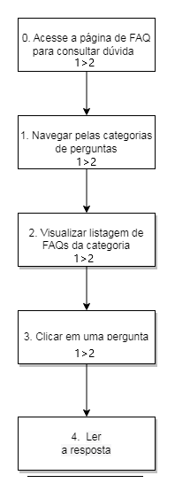
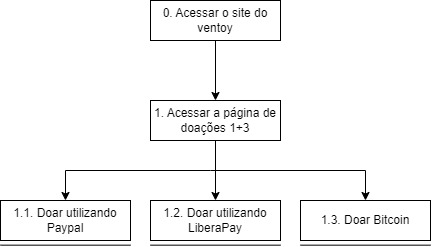
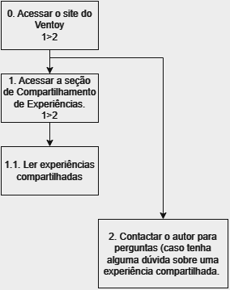

# Análise Hierárquica de Tarefas 

## Introdução 

A Análise Hierárquica de Tarefas (HTA - Hierarchical Task Analysis) é um método de análise de tarefas que é utilizado para obtermos um maior entendimento das competências e de quais tarefas os usuários realizam em um sistema e como eles realizam e o por quê, para nos ajudar a entender o processo da atividade e a identificar os problemas nesse processo.

Nesse método de análise de tarefas, iremos decompor as tarefas em objetivos, objetivo esse que representa o estado final de uma ação. No nível mais alto, os objetivos serão divididos subobjetivos, e a relação entre eles formam um plano, que é a definição de subobjetivos que irão garantir que seja possível atingir um objetivo. 

No nível mais baixo, cada subobjetivo será realizado por uma operação. Logo abaixo na figura 1, há uma demonstração do livro Interação Humano-Computador, de Barbosa e Silva, no capítulo 6, p. 193, que representa os elementos de um diagrama HTA.

<b>Figura 01</b> - Elementos de um diagrama HTA.

<b>Fonte</b>: Barbosa e Silva. Interação Humano-Computador. 1 ed.  ELSEVIER INC, 2010.  Capítulo 6, p. 193

## Análise Hierárquica de Tarefas (HTA)

Nessa seção iremos apresentar as análises de tarefas utilizando o método HTA do site Ventoy, utilizando representações em diagrama e tabela para um maior compreensão.

### Iniciar o uso do Ventoy

O diagrama feito para analisar esta tarefa foi representado em um diagrama na figura 2 e na tabela 1.  Nesta tarefa o usuário tem como objetivo iniciar o uso do Ventoy.

<b>Figura 02</b> - Diagrama HTA do iniciar uso do Ventoy

<b>Fonte</b>:  <a href="https://github.com/yabamiah">Vinicius Mendes.</a>

<b>Tabela 01</b> - Representação HTA em tabela da figura 2

|**Objetivos / Operações** | **Problemas e Recomendações** |
|:------------------------|:---------------------------------|
| 0. Começar a usar o Ventoy 1+2| **Feedback**: Criar um pendrive bootável.   **Plano**: Baixar o Ventoy e acessar a documentação.   **Recomendação**: Interface da documentação mais limpo e minimalista. | 
| 1. Escolher arquivo para instalação 1/2 | **Input**: Clicar em uma das opções de download de arquivos para diferentes sistemas operacionais.   **Plano**: Escolher arquivo compatível com o sistema do usuário. |
| 1.1. Arquivo para instalação em Windows |
| 1.2. Arquivo para instalação em Linux |
| 2. Acessar a documentação de uso do Ventoy no seu sistema operacional 1/2| **Input**: Selecionar tópico de uso do Ventoy na documentação.   **Plano**: Aprender a utilizar o Ventoy no sistema operacional atual do usuário. |
| 2.1. Documentação de uso no Windows |
| 2.2. Documentação de uso no Linux |

### Fazer Postagem no Fórum

O diagrama feito para analisar esta tarefa foi represento em um diagrama na figura 3 e na na tabela 2.
Nesta tarefa o usuário tem como objetivo criar um novo post no fórum do Ventoy.

<b>Figura 03</b> - Diagrama HTA fazer postagem no fórum

<b>Fonte</b>:  <a href="https://github.com/brenob6">Breno</a>

<b>Tabela 02</b> - Representação HTA em tabela da figura 3

|**Objetivos / Operações** | **Problemas e Recomendações** |
|:----------------------|:-------------------------------|
|0. Criar uma postagem em um fórum 1>2|**Plano:** Escrever uma postagem e publicar no fórum.   **Feedback** a nova postagem aparece no fórum com a tag recente.|
|1. Realizar login|**Input** dados de login do usuário.  **feedback** caso não tenha exito no login o usuário deve ser informado.|
|2. Escolher fórum |**Input**: Escolher um fórum que se adaque melhor ao tema da postagem.|
|3. Criar postagem 1+2|**Input**: clica em criar novo post.|
|3.1 Informar: assunto, texto, ícone |**Input**: escrever mensagem da postagem **Recomendação**: salvar rascunho caso o usuário não finalize a ação.|
|3.2 Anexar arquivo|**Input**: anexar algum arquivo ao post  **Recomendação**: permitir ao usuário inserir arquivo arrastando o arquivo.|

### Acessar a página de FAQ para consultar dúvida

O diagrama feito para analisar esta tarefa foi representado em um diagrama na figura 4 e na na tabela 3.
Nesta tarefa o usuário tem como objetivo procurar uma dúvida da instalação na página de FAQ (perguntas frequentes) Ventoy.

<b>Figura 04</b> - Diagrama HTA procurar dúvida na página de FAQ

<b>Fonte</b>:  <a href="https://github.com/Mayara-tech">Mayara Alves</a>

<b>Tabela 03</b> - Representação HTA em tabela da figura 4

|**Objetivos / Operações** | **Problemas e Recomendações** |
|:----------------------|:-------------------------------|
|0. Acessar a página de FAQ para consultar dúvida|**Plano:** Acessar a página de FAQ no site Ventoy.  **Feedback:** Garantir que os usuários encontrem facilmente o link para o FAQ.|
|1. Navegar pelas categorias de perguntas|**Input:** Clicar na categoria de dúvidas relacionada a dúvida.  **Feedback:** Disponibilizar categorias claras e organizadas. **Recomendação:** Inserir consulta de dúvida (Digitar a dúvida ou termos relacionados é realizar busca).
|2. Visualizar listagem de FAQs da categoria|**Feedback:** Apresentar uma lista de FAQs relacionados à categoria selecionada.|
|3. Clicar em uma pergunta|**Input:** Clicar em uma pergunta para expandir a resposta. **Feedback:** Tornar a expansão e contração de respostas intuitivas.|
|4.  Ler a resposta|**Feedback:** Garantir uma exibição clara e legível das respostas. **Recomendação:** Padronizar fonte, tamanho e cor do texto |

### Acessar a página de Doações para realizar uma doação

O diagrama feito para analisar esta tarefa foi representado em um diagrama na figura 5 e na tabela 4.
Na execução dessa tarefa, o usuário busca contribuir com o projeto Ventoy e apoiar os desenvolvedores por meio de uma doação.

<b>Figura 5</b> - Diagrama HTA realizar doação na página de doações 

<b>Fonte</b>:  <a href="https://github.com/LimirioGuimaraes">Limírio Guimarães</a>

<b>Tabela 04</b> - Representação HTA em tabela da figura 5

|**Objetivos / Operações** | **Problemas e Recomendações** |
|:----------------------|:-------------------------------|
|0. Acessar o site do ventoy|**Plano:** Acessar a página inicial do ventoy.  **Feedback:** Garantir que os usuários encontrem a página do ventoy na web.|
|1. Acessar a página de doações |**Plano:** Acessar a página de doações no site do ventoy.  **Feedback:** Garantir que os usuários encontrem facilmente o link para a aba de doações.  |
|1.1. Doar utilizando Paypal|**Input:** Clicar no link de doação por paypal. **Feedback:** Redirecionar o usuário para o site do paypal, na aba de doação para o projeto. **Recomendação:** Gerar QrCode para o usuário acessar o link por ele.|
|1.2. Doar utilizando LiberaPay|**Input:** Clicar no link de doação por liberaPay.. **Feedback:** Redirecionar o usuário para o site do liberapay, na aba de doação para o projeto. **Recomendação:** Gerar QrCode para o usuário acessar o link por ele.|
|1.3. Doar Bitcoin|**Output:** Gerar endereço de bitcoin, que permita o usuário copiar para realizar a doação. **Recomendação:** Gerar QrCode para o usuário copiar o endereço por ele.|

<b>Fonte</b>:  <a href="https://github.com/LimirioGuimaraes">Limírio Guimarães</a>

### Acessar a página de Testes De Iso 

O diagrama feito para analisar esta tarefa foi representado em um diagrama na figura 6 e na tabela 5.
Na execução dessa tarefa, o usuário busca contribuir ou se aproveitar com o projeto Ventoy e apoiar os desenvolvedores por meio de um Teste de Iso.

<b>Figura 6</b> - Diagrama HTA realizar Testes de Iso na página Testes de Iso

<b>Fonte</b>:  <a href="https://github.com/LuisMiranda10">Luis Miranda</a>

<b>Tabela 05</b> - Representação HTA em tabela da figura 5

|**Objetivos / Operações** | **Problemas e Recomendações** |
|:----------------------|:-------------------------------|
|0. Acessar o site do ventoy|**Plano:** Acessar a página inicial do ventoy.  **Feedback:** Garantir que os usuários acessem a página do ventoy na web.|
|1. Acessar a página de Testes de Iso |**Plano:** Acessar a página de Testes de Iso no site do ventoy.  **Feedback:** Garantir que os usuários encontrem facilmente o link para a aba de Testes de Iso.  |
|1.1. Verificar os Testes de Iso já feitos|**Input:** Visualizar listagem de Testes de Iso da categoria. **Feedback:** Apresentar uma lista de Testes de Iso relacionados à categoria procurada  **Recomendação:** Inserir consulta para melhor localização da distribuição desejada .|
|1.2. Criar um Teste de Iso|**Input:** Clicar em criar Teste de Iso   |
|1.2.1. Anexar arquivo|**Input**: Solicitar o pull request de Teste de Iso   **Recomendação**: Permitir ao usuário inserir por si próprio na lista de testes de iso.  | 

<b>Fonte</b>:  <a href="https://github.com/LuisMiranda10">Luis Miranda</a>

### Acessar a página de Compartilhamento de Experiências 

O diagrama feito para analisar esta tarefa foi representado em um diagrama na figura 7 e na tabela 6. Na execução dessa tarefa, o usuário busca acessar o site do Ventoy e explorar experiências. Ele tem a opção de ler experiências compartilhadas e entrar em contato com o autor da experiência para fazer perguntas. Essa interação ajuda a comunidade do Ventoy a trocar informações e insights úteis sobre o projeto.

<b>Figura 7</b> - Diagrama HTA acessar a página de Compartilhamento de Experiências 

<b>Fonte</b>:  <a href="https://github.com/arthurrochamoreira">Altino Arthur</a>

<b>Tabela 06</b> - Representação HTA em tabela da figura 7

|**Objetivos / Operações** | **Problemas e Recomendações** |
|:----------------------|:-------------------------------|
|0. Acessar o site do ventoy|**Plano:** Acessar a página inicial do ventoy.  **Feedback:** Garantir que os usuários acessem a página do ventoy na web.|
|1. Acessar a seção de Compartilhamento de Experiências|**Plano:** Acessar a seção de Compartilhamento de Experiências após entrar no site do ventoy.  **Feedback:** Garantir que os usuários encontrem facilmente a seção de compartilhamento.|
|1.1. Ler experiências compartilhadas|**Input:** Visualizar as experiências compartilhadas por outros usuários.  **Feedback:** Oferecer uma interface amigável para a leitura das experiências.|
|2. Contactar o autor para perguntas|**Input:** Utilizar um meio de contato para fazer perguntas ao autor da experiência.  **Feedback:** Garantir uma comunicação eficiente entre os usuários e os autores das experiências.|

<b>Fonte</b>:  <a href="https://github.com/arthurrochamoreira">Altino Arthur</a>

### Acessar a página de Plugin

O diagrama feito para analisar esta tarefa foi representado em um diagrama na figura 8 e na tabela 7. Na execução dessa tarefa, o usuário busca acessar a página de plugin do ventoy. Ele tem a opção de visualizar a documentação para personalizar e aprimorar o Ventoy, por meio de um plugin.

<b>Figura 8</b> - Diagrama HTA acessar a página de Plugin 

<b>Fonte</b>:  <a href="https://github.com/MilenaBaruc">Milena Baruc</a>

<b>Tabela 07</b> - Representação HTA em tabela da figura 8

|**Objetivos / Operações** | **Problemas e Recomendações** |
|:----------------------|:-------------------------------|
|0. Acessar o site do ventoy|**Plano:** Acessar a página inicial do ventoy.  **Feedback:** Garantir que os usuários acessem a página do ventoy na web.|
|1. Acessar a página de plugin|**Plano:** Acessar a página de plugin após entrar no site do ventoy.  **Feedback:** Garantir que os usuários encontrem facilmente a página de plugin.|
|2. Ler a documentação sobre plugin|**Input:** Ler a documentação sobre plugin compartilhada pelos desenvolvedores.  **Feedback:** Oferecer uma interface amigável para a leitura da documentação.|
|3. Acessar a documentação sobre plugin|**Input:** Acessar a documentação sobre plugin por meio de um link fornecido.  **Feedback:** Garantir que o link fornecido está correto e esteja com seus dados atualizados.|

<b>Fonte</b>:  <a href="https://github.com/arthurrochamoreira">Altino Arthur</a>

## Bibliografia
>Barbosa e Silva. Interação Humano-Computador. 1 ed.  ELSEVIER INC, 2010.  Capítulo 6, p. 193.

## Referência Bibliográfica
> Barbosa e Silva. Interação Humano-Computador. 1 ed.  ELSEVIER INC, 2010.

## 📑 Histórico de Versões
| **Versão**   |   **Data**   | **Descrição** | **Autor** | **Revisor** |
|--------------|--------------|---------------|-----------|-------------|
|`1.0`| 14/10/2023 | Criação da página de analise de tarefas | [Vinícius Mendes](https://github.com/yabamiah), [Breno](https://github.com/brenob6) e [Mayara Alves ](https://github.com/Mayara-tech)| [Altino Arthur](https://github.com/arthurrochamoreira)|
|`2.0`| 20/10/2023 | Adicionado diagrama HTA da tarefa doação | [Limirio Guimarães](https://github.com/LimirioGuimaraes)| [Luis Miranda](https://github.com/LuisMiranda10) |
|`2.1`| 20/10/2023 | Adicionado representação HTA em tabela da figura 5 | [Limirio Guimarães](https://github.com/LimirioGuimaraes)| [Luis Miranda](https://github.com/LuisMiranda10) |
|`2.2`| 23/10/2023 | Adicionado representação HTA da tarefa Compartilhamento de Experiências | [Altino Arthur](https://github.com/arthurrochamoreira)| [Milena Baruc](https://github.com/MilenaBaruc) |
|`2.3`| 07/11/2023 | Adicionado representação HTA da tarefa Plugin | [Milena Baruc](https://github.com/MilenaBaruc)| [Luis Miranda](https://github.com/LuisMiranda10) |
