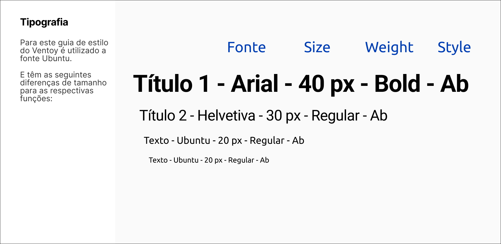
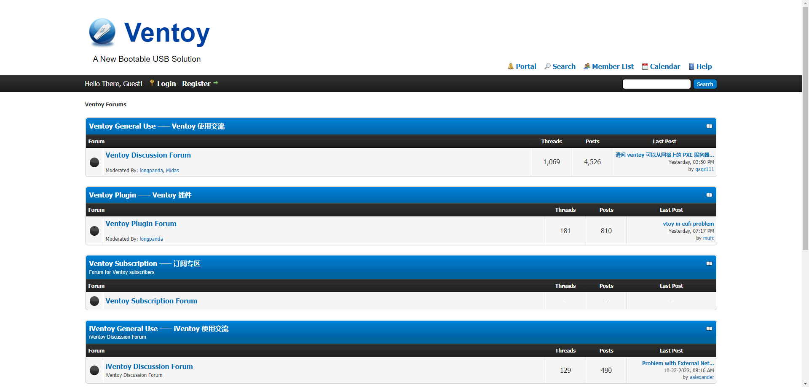
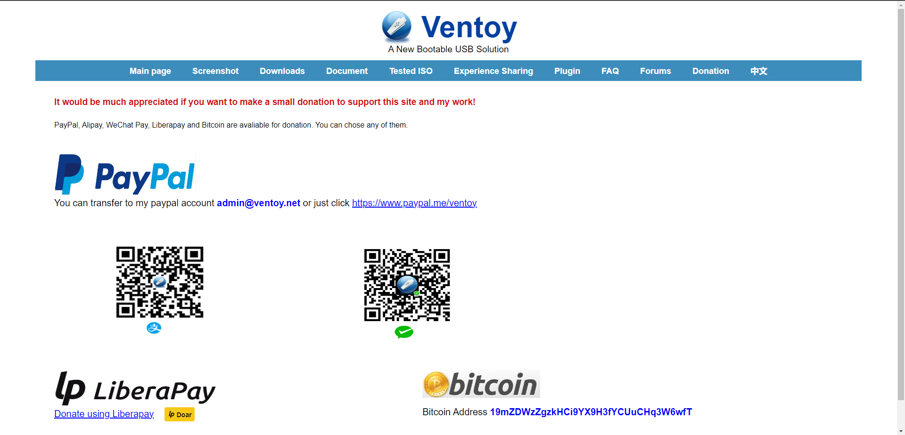

## Introdução

Segundo Barbosa e Silva (2011, p.282)[^1], o Guia de Estilo é um registro vital das decisões de design, assegurando sua efetiva incorporação no produto final. No contexto do Ventoy, este guia é uma ferramenta chave para comunicar decisões de design com os stakeholders, facilitando consultas e discussões para futuras projeções e atualizações, garantindo interfaces que atendam às necessidades específicas dos usuários do Ventoy.

## Objetivo do Guia de Estilo

Este guia visa fornecer diretrizes e melhores práticas para o design e desenvolvimento de interfaces de usuário eficazes e usáveis no Ventoy, enfocando elementos como disposição espacial, tipografia, cores, símbolos e estilos de interação. Ele serve como um roteiro para assegurar que as funcionalidades do Ventoy sejam intuitivas e acessíveis, melhorando a experiência do usuário.

## Princípios Gerais de IHC

Incorporamos princípios gerais de IHC, aplicados ao contexto do Ventoy:

- **Consistência**: Mantém elementos similares com comportamentos similares em todo o Ventoy.
- **Feedback**: Garante informações claras sobre ações e alterações de estado no Ventoy.
- **Prevenção de Erros**: Design do Ventoy que antecipa e evita erros comuns dos usuários.
- **Eficiência de Uso**: Otimização das operações mais comuns no Ventoy para agilizar a interação.
- **Estética e Design Minimalista**: Interfaces do Ventoy com apenas informações essenciais.
- **Reconhecimento em vez de Lembrança**: Facilita o reconhecimento de opções no Ventoy.

### Organização e Conteúdo do Guia de Estilo

O guia de estilo do Ventoy será organizado da seguinte forma: Elementos de interface, Elementos de interação, Elementos de ação, Resultados da análise e Proposta de Intervenção. Isso visa otimizar a experiência do usuário e efetivar a interação e padronização dentro do site.

### Público-alvo do Guia de Estilo

Este Guia de Estilo é destinado a:

- **Usuários do Ventoy**: Facilita a interação com a tecnologia.
- **Desenvolvedores**: Auxilia na execução do design da interface de acordo com as orientações do guia.
- **Entusiastas de Tecnologia**: Contribui para a melhoria da experiência do usuário e o sucesso da plataforma.
- **Designers**: Ajuda na elaboração e modelagem da interface, assegurando a aplicação correta dos princípios de design.

### Como utilizar o Guia

O Guia de Estilo é uma ferramenta essencial para manter a integridade visual e a coesão do site do Ventoy. Sua utilização assegura a manutenção da identidade da marca e uma experiência do usuário consistente e agradável. O guia serve como um recurso de apoio criativo, economizando tempo e criando uma experiência visualmente harmoniosa para os usuários. Além disso, é uma referência contínua durante todo o ciclo de vida do projeto, desde a produção até a manutenção.

### Como manter o Guia

Para manter o guia de estilo alinhado com o desenvolvimento do projeto e garantir uma experiência melhorada para o usuário:

1. **Responsabilidades Designadas**: Atribuição clara de responsabilidades para manutenção e atualização do guia.
2. **Teste Constante**: Verificação contínua para assegurar que o guia de estilo está sendo seguido.
3. **Versionamento e Controle de Mudanças**: Sistema de versionamento e processo de controle de mudanças para gerenciar as alterações.
4. **Feedback Contínuo**: Abertura para feedbacks de equipe, usuários e partes interessadas, usando-os para aprimorar o guia.

## Elementos de Interface

### Disposição Espacial e Grid

O layout principal do Ventoy consiste em cabeçalho, conteúdo e rodapé, com organização em seções e subseções, alinhados e espaçados seguindo os princípios de consistência e design minimalista.

### Janelas

O site do Ventoy não possui janelas pop-up, mas sua estrutura permite visualizar seções separadas como "janelas" virtuais, melhorando a navegação e reconhecimento.

### Tipografia

O Ventoy utiliza fontes como "arial, helvetica, sans-serif", com variação de tamanhos e formatações como negrito e itálico. A fonte Ubuntu é destacada neste guia pela sua clareza e modernidade.

 <b>Figura 1</b>. Tipografia 

Fonte: Altino Arthur

### Cores

O guia detalha a paleta de cores utilizada no Ventoy, incluindo cores de fundo, texto e botões, e sua aplicação para manter a identidade visual coesa.

 <b>Figura 2</b>. Cores 

Fonte: Luis Miranda

### Símbolos não tipográficos

Os símbolos não tipográficos são essenciais para a interação intuitiva no Ventoy, seguindo princípios de eficiência de uso e prevenção de erros.

 <b>Figura 3</b>. Símbolos não tipográficos 

Fonte: Altino Arthur

Os elementos estão representados na figura 5 abaixo. 

 <b>Figura 3</b>. Simbolos não tipograficos 

Fonte: Altino Arthur

## Elementos de Interação

### Estilo de Interação

Esses elementos do estilo de interação englobam botões de ação, links de navegação e ícones que, juntos, facilitam a navegação intuitiva e eficaz pelos recursos e informações disponíveis. Além disso, elementos de realce, como animações suaves ou mudanças visuais ao passar o mouse sobre itens interativos, fornecem feedback imediato aos usuários, tornando a experiência mais envolvente. 

### Seleção de Estilos

Uma série de elementos de interação de seleções de estilo existe dentro do site, projetados para aprimorar a usabilidade e a personalização da experiência do usuário. Isso inclui botões de seleção, listas suspensas e barras de rolagem que permitem aos visitantes escolher opções, configurar preferências e navegar com eficiência. 

### Aceleradores (Teclas de Atalho)

No site não foram encontradas teclas de atalho.

## Elementos de Ação

### Preenchimento de Campos

 <b>Figura 4</b>. Preenchimento de Campos 

Fonte: Altino Arthur

Campos de entrada, caixas de seleção e botões de envio são disponibilizados para os visitantes fornecerem informações, configurar preferências e realizar ações específicas, como é visto na aba de fórum (Figura - 4). 

### Seleção

 <b>Figura 5</b>. Seleção 

Fonte: Altino Arthur

Há elementos de seleção como por exemplo seleção de tópicos, seleção de testes de Iso, seleção de perguntas, seleção de fórum, seleção de versão para download, seleção de ferramenta para doação ( paypal, bitcoin ) (Como é visto na figura - 5) e também de idioma. Determinando de maneira clara e intuitiva como o usuário pode efetuar a escolha de elementos ou a seleção de itens.

### Ativação

Apresenta pouca variedade de elementos de ação de ativação projetados para facilitar a interação do usuário. Isso inclui botões intuitivos que desencadeiam ações, como por exemplo os ícones da figura 5, como também o download do software, navegação pelas páginas, acesso a informações essenciais, hyperlinks ( direcionam os visitantes para áreas específicas do site, facilitando a exploração de informações e recursos ). 

## Resultados da Análise

### Descrição do Ambiente de Trabalho do Usuário

A Ventoy é predominantemente utilizada em ambientes de trabalho por meio de dispositivos como pendrives e discos USB. Portanto, é fundamental considerar as especificidades desses dispositivos ao projetar e desenvolver a interface, garantindo uma experiência satisfatória para os usuários que utilizam a Ventoy nesses contextos. Isso envolve a adaptação da interface para diferentes tamanhos de tela, a escolha de elementos visuais apropriados e a implementação de funcionalidades intuitivas.

## Figma

&emsp;&emsp;Consulte o Figma 1 para visualizar os elementos de interface, interação e ação definidos no guia de estilo, com exemplos visuais e especificações detalhadas. Qualquer alteração irá ser atualizada imediatamento no Figma 1.

<iframe style="border: 1px solid rgba(0, 0, 0, 0.1);" width="800" height="450" src="https://www.figma.com/embed?embed_host=share&url=https%3A%2F%2Fwww.figma.com%2Ffile%2FmRAQJlidsGWJQ5Hn9j1Kcp%2FGuia-De-Estilo---Ventoy%3Ftype%3Ddesign%26node-id%3D0%253A1%26mode%3Ddesign%26t%3D6MuVVY3eJSwWOsxK-1" allowfullscreen></iframe>

 <b>Figma 1</b>: Guia de Estilo (Fonte: MOREIRA, Altino; MIRANDA, Luis. 2023). 

## Propostas de Intervenção

- Implementação de aceleradores (teclas de atalho) para agilizar tarefas comuns.

- Melhorias na disposição espacial e na utilização do grid para facilitar o uso da Ventoy.

- Padronização de elementos visuais, como cores e tipografia, para manter uma identidade visual coesa.

- Manutenção de um vocabulário consistente para garantir a compreensão dos usuários.

- Essas intervenções têm como objetivo principal aprimorar a interação entre o usuário e a Ventoy, tornando-a mais amigável e eficaz, seguindo as melhores práticas de usabilidade e design.

## Conclusão

&emsp;&emsp; Desenvolvemos um guia de estilo para o site do Ventoy, fundamentado em princípios de IHC, visando uma experiência do usuário consistente e intuitiva.

&emsp;&emsp; Durante a criação do guia de estilo foi utilizado um comportamento flexível e adaptado às necessidades específicas do site, nos quais fornecerão uma estrutura sólida para o desenvolvimento de um guia de estilo eficaz. 

&emsp;&emsp; Aos usuários do Ventoy, Desenvolvedores, Entusiastas de Tecnologia e Designers seguirem o guia de estilo do site do Ventoy, uma série de benefícios é desencadeada. A consistência visual em todo o site é mantida, criando uma experiência mais intuitiva e agradável para os usuários, à medida que os elementos de interface, cores, tipografia e elementos interativos são aplicados de maneira uniforme. Além de uma manutenção recorrente feita pelos mesmos no projeto ( tendo como referencia o protótipo de alta fidelidade ). 

## Referências Bibliográficas

- BARBOSA, S. D. J.; SILVA, B. S. Interação Humano-Computador. Rio de Janeiro: Elsevier, 2011.
- Norman, D. A. The Design of Everyday Things. Basic Books, 2013.
- Shneiderman, B., et al. Designing the User Interface. 6th ed., Pearson, 2016.

[^1]: Barbosa, S. D. J.; Silva, B. S. Interação Humano-Computador. Rio de Janeiro: Elsevier, 2011.

## Bibliografia

[1] Ventoy.  Disponível em: https://www.ventoy.net/en/index.html . Acesso em: 22 de Outubro de 2023;

## Histórico de Versões

| Versão  | Data       | Descrição       | Autor(es)                | Revisor(es)                                                                                         |
| ------- | ---------- | ------------------------------------ | ------------------------------------------ | ---------------------------- |
| `1.0`   | 23/10/2023 | Criação da página guia de estilo.              | [Altino Arthur](https://github.com/arthurrochamoreira) e [Luis Miranda](https://github.com/LuisMiranda10 )        |  Vinicius Mendes   |
| `1.1`   | 05/12/2023 | Inclusão de embasamento teórico e revisão das referências.  | [Altino Arthur](https://github.com/arthurrochamoreira) | Vinicius Mendes     |
