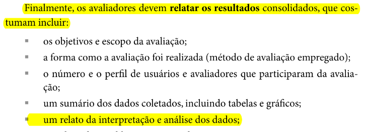
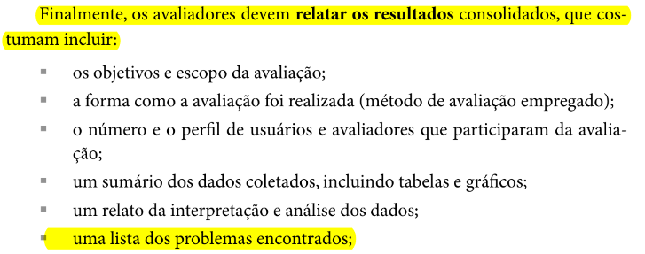

# Relato do resultado do Protótipo de Papel Acessar a página de Compartilhamento de Experiências para consultar relatos

## Introdução

Este documento é uma verificação do artefato [Relato do resultado do Protótipo de Papel Acessar a página de Compartilhamento de Experiências para consultar relatos](https://interacao-humano-computador.github.io/2023.2-Ventoy/DAD/nivel2/prototipoDePapel/RelatoEXP/) na versão 1.7 de data 20/11/2023, autorado por [Mayara Alves](https://github.com/Mayara-tech), que é integrante do [grupo 02](https://github.com/Requisitos-de-Software/2023.2-Carteira_Digital_de_Transito), cujo projeto tem como foco o [Relato do resultado do Protótipo de Papel Acessar a página de Compartilhamento de Experiências para consultar relatos](https://play.google.com/store/apps/details?id=br.gov.serpro.cnhe&hl=pt_BR&gl=US), o propósito desta verificação é identificar possíveis problemas no artefato.

## Metodologia

A verificação do artefato seguirá o [planejamento](https://github.com/Requisitos-de-Software/2023.2-Carteira_Digital_de_Transito/blob/main/docs/verificacao/grupo2/planejamentoDaVerificacao.md) estabelecido pelo nosso grupo. Conforme detalhado no planejamento, destaca-se a relevância do subtópico da metodologia neste documento, para apresentar a tabela contendo os checklists utilizados para realizar essa verificação deste artefato em específico. Podemos observar o referido checklist referente a verificação do Cronograma na Tabela 1, as perguntas foram tiradas da verificação da [Relato dos Resultados da Avaliação da Análise de tarefas](https://interacao-humano-computador.github.io/2023.2-Ventoy/DAD/nivel2/prototipoDePapel/RelatoEXP/) feita anterirormente pelo grupo.

**Tabela 1** - Checklist Geral

| ID | Critério de Avaliação                           | Avaliação ( Sim/ Não / Não Aplicável )             | Observações                       | Referências                                                    |
|----| ------------------------------------------------|----------------------------------------------------|-----------------------------------|----------------------------------------------------------------|
| 1  | O histórico de versão é padronizado?                                           |     Sim       |            |  REQUISITOS DE SOFTWARE. Carteira Digital de Trânsito. Distrito Federal, 2023. Disponível em: <https://github.com/Requisitos-de-Software/2023.2-Carteira_Digital_de_Transito/>. Acesso em: 02/12/2023.          |            
| 2  | Possui o(s) autor(es) e o(s) revisor(es) do artefato?                          |     Sim       |            |  REQUISITOS DE SOFTWARE. Carteira Digital de Trânsito. Distrito Federal, 2023. Disponível em: <https://github.com/Requisitos-de-Software/2023.2-Carteira_Digital_de_Transito/>. Acesso em: 02/12/2023.          | 
| 3  | O artefato possui referências bibliográficas e/ou bibliografia?                |     Sim       |            |  REQUISITOS DE SOFTWARE. Carteira Digital de Trânsito. Distrito Federal, 2023. Disponível em: <https://github.com/Requisitos-de-Software/2023.2-Carteira_Digital_de_Transito/>. Acesso em: 02/12/2023.          | 
| 4  | Todos os textos estão na norma padrão?                                         |     Sim       |            |   REQUISITOS DE SOFTWARE. Carteira Digital de Trânsito. Distrito Federal, 2023. Disponível em: <https://github.com/Requisitos-de-Software/2023.2-Carteira_Digital_de_Transito/>. Acesso em: 02/12/2023.         | 
| 5  | Há introdução do artefato?                                                     |     Sim       |            |    REQUISITOS DE SOFTWARE. Carteira Digital de Trânsito. Distrito Federal, 2023. Disponível em: <https://github.com/Requisitos-de-Software/2023.2-Carteira_Digital_de_Transito/>. Acesso em: 02/12/2023.        | 
| 6  | Há metodologia de como foi conduzido o artefato?                               |     Sim       |            |  REQUISITOS DE SOFTWARE. Carteira Digital de Trânsito. Distrito Federal, 2023. Disponível em: <https://github.com/Requisitos-de-Software/2023.2-Carteira_Digital_de_Transito/>. Acesso em: 02/12/2023.          | 

Fonte: [Vinícius Mendes](https://github.com/yabamiah)

**Tabela 2** - Checklist Específico

| ID | Critério de avaliação | Avaliação (Sim/Não/Não aplicável) | Observações | Referências | Imagem da Referência |
|---|----------------------|------------------------------------|---------------|--------------|-------------|
|01| A consolidação dos dados do relato dos resultados, utilizou a análise de intersujeito? | | | Página: 311, Capítulo 9. Planejamento da Avaliação de IHC. Livro: SIMONE DINIZ JUNQUEIRO BARBOSA, BRUNO SANTANA DA SILVA, Interação Humano-Computador, 1a. Edição, Editora Campus, 2010|  |
|02| No relato do resultado foi descrito os objetivos que motivaram a avaliação? | | | Página: 312, Capítulo 9. Planejamento da Avaliação de IHC. Livro: SIMONE DINIZ JUNQUEIRO BARBOSA, BRUNO SANTANA DA SILVA, Interação Humano-Computador, 1a. Edição, Editora Campus, 2010| |
|03| Os problemas encontrados, foram descritos como tendências de problemas? | | | Página: 312, Capítulo 9. Planejamento da Avaliação de IHC. Livro: SIMONE DINIZ JUNQUEIRO BARBOSA, BRUNO SANTANA DA SILVA, Interação Humano-Computador, 1a. Edição, Editora Campus, 2010| |
|04| Se caso não houver problemas encontrados, foi descrito que não pode ser afirmado que o sistema tenha alta qualidade? | | | Página: 312, Capítulo 9. Planejamento da Avaliação de IHC. Livro: SIMONE DINIZ JUNQUEIRO BARBOSA, BRUNO SANTANA DA SILVA, Interação Humano-Computador, 1a. Edição, Editora Campus, 2010| |
|05| No relato do resultado, foi descrito como a avaliação foi realizada? (Como ocorreu o método de avaliação utilizado) | | | Página: 312, Capítulo 9. Planejamento da Avaliação de IHC. Livro: SIMONE DINIZ JUNQUEIRO BARBOSA, BRUNO SANTANA DA SILVA, Interação Humano-Computador, 1a. Edição, Editora Campus, 2010| |
|06| No relato do resultado, foi descrito o número e perfil de usuários e avaliadores que participaram da avaliação? | | | Página: 312, Capítulo 9. Planejamento da Avaliação de IHC. Livro: SIMONE DINIZ JUNQUEIRO BARBOSA, BRUNO SANTANA DA SILVA, Interação Humano-Computador, 1a. Edição, Editora Campus, 2010| |
|07| No relato do resultado, foi apresentado uma organização dedados coletados? (Como tabelas, gráficos e sumário) | | | Página: 312, Capítulo 9. Planejamento da Avaliação de IHC. Livro: SIMONE DINIZ JUNQUEIRO BARBOSA, BRUNO SANTANA DA SILVA, Interação Humano-Computador, 1a. Edição, Editora Campus, 2010| |
|08| No relato do resultado, foi apresentado uma interpretação e análise dos dados? | | |Página: 312, Capítulo 9. Planejamento da Avaliação de IHC. Livro: SIMONE DINIZ JUNQUEIRO BARBOSA, BRUNO SANTANA DA SILVA, Interação Humano-Computador, 1a. Edição, Editora Campus, 2010 | |
|09| No relato do resultado, foi apresentado uma lista dos problemas encontrados? | | | Página: 312, Capítulo 9. Planejamento da Avaliação de IHC. Livro: SIMONE DINIZ JUNQUEIRO BARBOSA, BRUNO SANTANA DA SILVA, Interação Humano-Computador, 1a. Edição, Editora Campus, 2010| |
|10| No relato do resultado, foi apresentado um planejamento desugestões de melhorias para o projeto? | | | Página: 312, Capítulo 9. Planejamento da Avaliação de IHC. Livro: SIMONE DINIZ JUNQUEIRO BARBOSA, BRUNO SANTANA DA SILVA, Interação Humano-Computador, 1a. Edição, Editora Campus, 2010|  |

Fonte: [Vinícius Mendes](https://github.com/yabamiah)

## Desenvolvimento

Na tabela 2 podemos observar o checklist preenchido após verificação do artefato. Este checklist, minuciosamente preenchido, reflete os resultados, observações e considerações resultantes da análise realizada no artefato. A inspeção foi feita por meio uma gravação individual, que está presentes na tabela 3.

**Tabela 3** - Checklist Geral

| ID | Critério de Avaliação                           | Avaliação ( Sim/ Não / Não Aplicável )             | Observações                       |
|----| ------------------------------------------------|----------------------------------------------------|-----------------------------------|
| 1  | O histórico de versão é padronizado?                                           |      Sim     |            |            
| 2  | Possui o(s) autor(es) e o(s) revisor(es) do artefato?                          |    Incompleto        |      Faltou o nome do revisor   |  
| 3  | O artefato possui referências bibliográficas e/ou bibliografia?                |    Sim        |            |   
| 4  | Todos os textos estão na norma padrão?                                         |     Sim   |            |   
| 5  | Há introdução do artefato?                                                     |      Sim     |            | 
| 6  | Há metodologia de como foi conduzido o artefato?                               |      Sim      |            |

Fonte: [Vinícius Mendes](https://github.com/yabamiah)

**Tabela 4** - Checklist preenchido

| ID | Critério de avaliação | Avaliação (Sim/Não/Não aplicável) | Observações |
|---|----------------------|------------------------------------|---------------|
|01| A consolidação dos dados do relato dos resultados, utilizou a análise de intersujeito? | Sim | | 
|02| No relato do resultado foi descrito os objetivos que motivaram a avaliação? | Sim | |
|03| Os problemas encontrados, foram descritos como tendências de problemas? | Não aplicável | | 
|04| Se caso não houver problemas encontrados, foi descrito que não pode ser afirmado que o sistema tenha alta qualidade? | Não | |
|05| No relato do resultado, foi descrito como a avaliação foi realizada? (Como ocorreu o método de avaliação utilizado) | Incompleto | | 
|06| No relato do resultado, foi descrito o número e perfil de usuários e avaliadores que participaram da avaliação? | Sim | |
|07| No relato do resultado, foi apresentado uma organização de dados coletados? (Como tabelas, gráficos e sumário) | Sim | | 
|08| No relato do resultado, foi apresentado uma interpretação e análise dos dados? | Sim | |
|09| No relato do resultado, foi apresentado uma lista dos problemas encontrados? | Não aplicável | | 
|10| No relato do resultado, foi apresentado um planejamento de sugestões de melhorias para o projeto? | Não aplicável | | 

Fonte: [Vinícius Mendes](https://github.com/yabamiah)

**Tabela 3** - Cronograma de verificação

| Participantes | Data | Horário | Link da Gravação |
|--------------|-------|---------|------------------|
| Vinícius Mendes | 03/12/2023 | 14:40/14:47| [Link da gravação](https://youtu.be/fIrZ-4p31M0) |

## Sugestões de Melhorias
De acorda com a inspeção feita, foi possível encontrar algumas possíveis melhorias para o artefato em questão, as melhorias serão descritas logo abaixo junto ao ID da verificação:
- **ID04**: Só acrescentar que por não ter encontrado problemas com o usuário, não significa que o protótipo de papel está na sua melhor forma.
- **ID05**: Acrescentar o local onde ocorreu a avaliação.

## Referência Bibliográfica
> Carteira Digital de Trânsito. Requisitos de Software. Distrito Federal, 2023. Disponível em: https://requisitos-de-software.github.io/2023.2-Carteira_Digital_de_Transito/. Acesso em: 02/12/2023

## Bibliografia
> SIMONE DINIZ JUNQUEIRO BARBOSA, BRUNO SANTANA DA SILVA, Interação Humano-Computador, 1a. Edição, Editora Campus, 2010

## 📑 Histórico de Versões

| Versão | Data | Descrição | Autor | Revisor |
|--------|------|------------|-------|--------|
|`1.0`| 04/12/2023| Criação do documento | [Vinícius Mendes](https://github.com/yabamiah)| |
